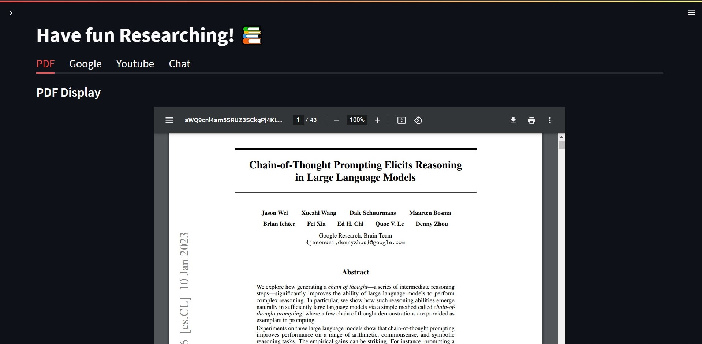
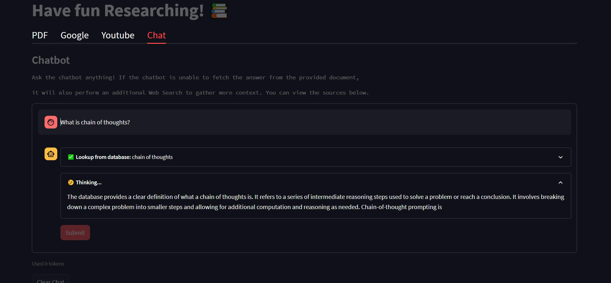
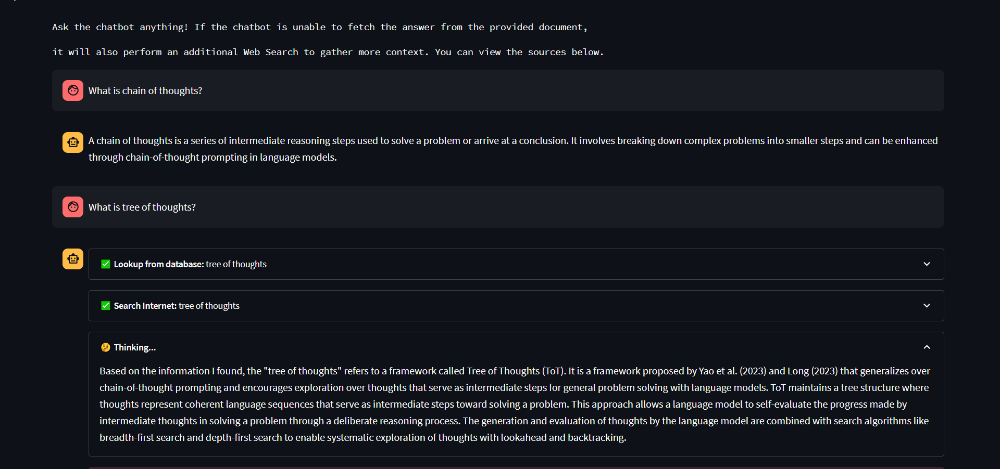
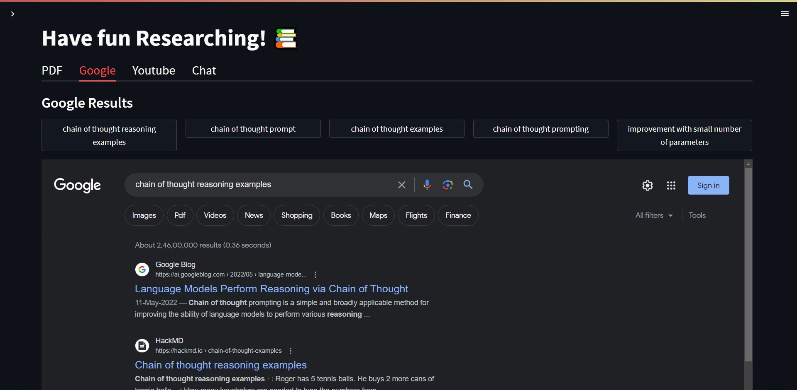
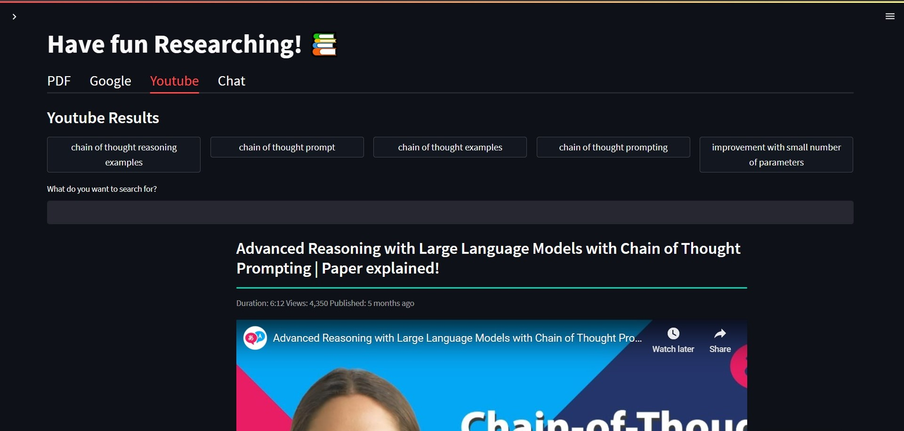
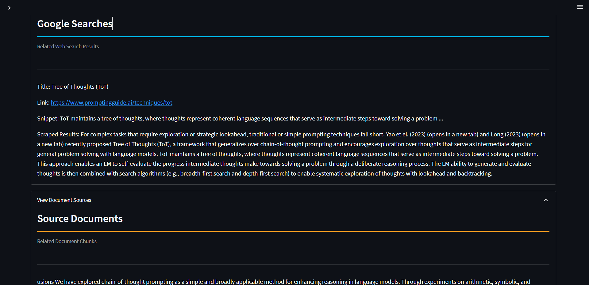

# DocumentGPT

DocumentGPT is a web application that allows you to chat over your research document using OpenAI's chat API and perform semantic search using vector databases. This tool provides a seamless interface for interacting with your research document, exploring search results, and engaging in a conversation with an AI chatbot.

## Features

- Upload your PDF document and view its contents within the web app.
- Chat with an AI chatbot powered by OpenAI's chat API, using the content of your research document.
- Perform Google search directly from the chat interface to quickly find relevant information.
- Search for YouTube videos related to your research topic and watch them within the app.
- Get semantic search results from your research document using vector databases.
- Easy-to-use interface with multiple pages for a smooth user experience.

## Screenshots
  
- **Display PDF**: 
  
- **ChatBot**: 

- **ChatBot performing WebSearch**: 
  
- **Show Google Results**: 
  
- **Show Youtube Results**: 

- **View All Sources**: 

## How to Use

1. Clone the repository: `git clone https://github.com/your-username/DocumentGPT.git`
2. Install the required dependencies: `pip install -r requirements.txt`
3. Set up your OpenAI API key and provide it in the web app.
4. Run the application: `streamlit run main.py`
5. Access the web app in your browser at `http://localhost:8501`.

## Further Improvements

Here are some areas for further improvement in DocumentGPT:

- ✅ **Token Streaming**: Implement token streaming to handle long conversations more efficiently.
- ✅**Add Document Citations**: Add interface for showing document citations by including more metadata.
- ✅**Agents**: Enable several plugins like google search and other features within the chatbot.
- ✅ **Improved User Interface**: Enhance the user interface.

## Demo

You can try out the chatbot by visiting the deployed app on Streamlit Cloud:
[Deployed App](https://aju22-documentgpt-app-zxpzom.streamlit.app/)

*Note: Unfortunately PDF Display works fine locally, but in the deployed app only works on certain browsers like Safari, Firefox :(*

## Contributing

Contributions to DocumentGPT are welcome! If you have any feedback, suggestions, or bug reports, please create an issue in the GitHub repository. You can also contribute to the project by submitting pull requests with your enhancements.

## License

This project is licensed under the [MIT License](LICENSE).

## Acknowledgements

DocumentGPT is built using Streamlit, OpenAI Chat API, Langchain and various open-source libraries. I would like to acknowledge the contributions of the developers and contributors of these libraries.
